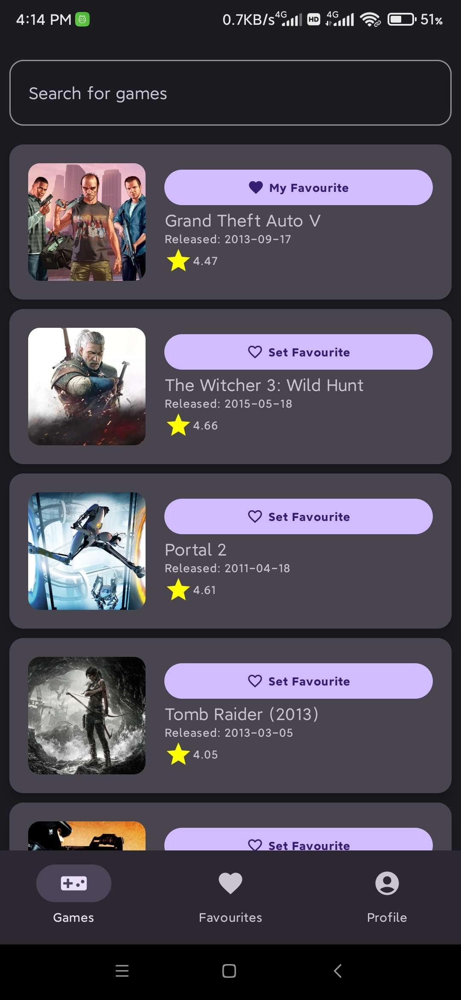
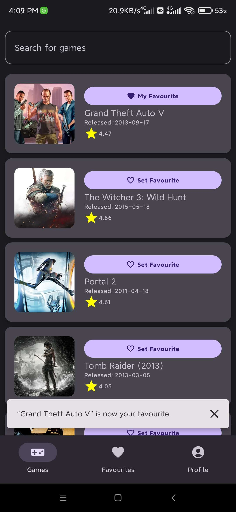
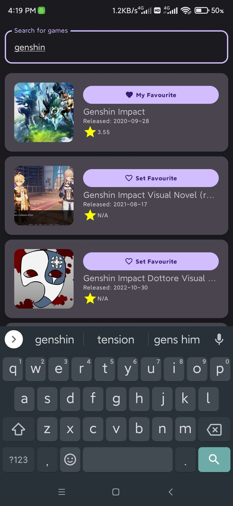
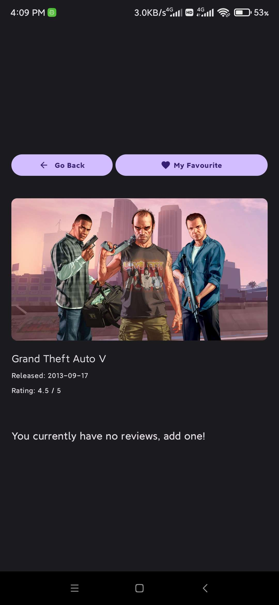
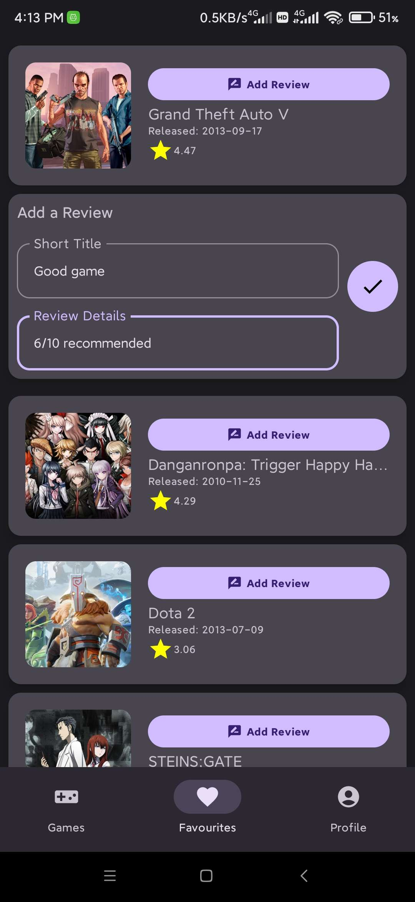
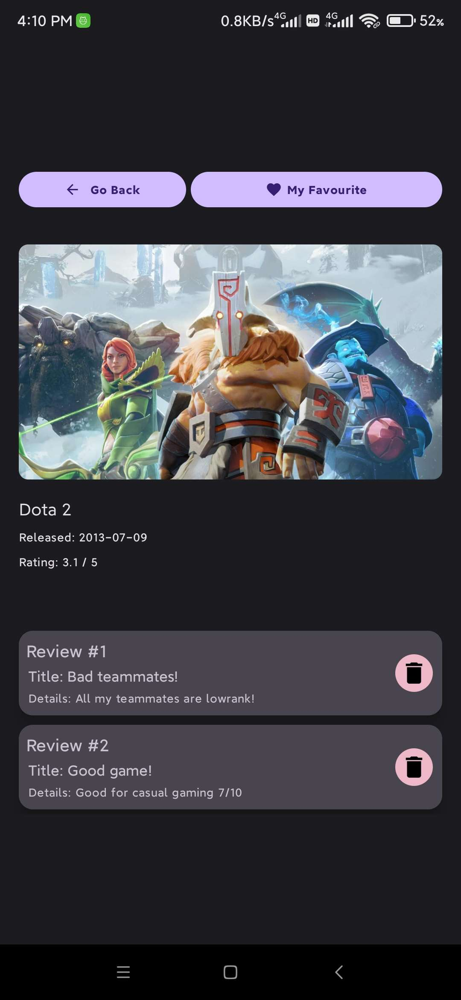
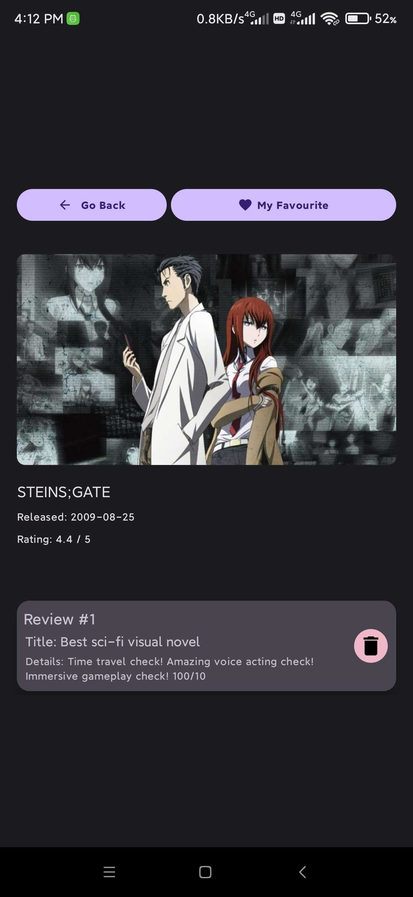

# Modern Android Application

This application demonstrates a modern Android application using the Clean Architecture approach, best practices, design patterns, SOLID principles, and other notable technologies. The application uses Kotlin, Retrofit for networking, Room for local data persistence, Coroutines for background tasks, Flow for data streams, and Dagger Hilt for dependency injection. It adheres to the MVVM design pattern and utilizes the repository pattern for data management.

## Clean Architecture

Clean Architecture separates code into layers, making the codebase easier to manage, test, and scale. It isolates changes in an application, leading to better maintainability.

### Core (Domain) Layer

The Core or Domain Layer is the central part of the architecture and is completely independent. It contains business logic, use cases, and entities (domain models), and defines rules for how the data can be accessed and modified. It doesn't depend on any other layer, ensuring that business logic is decoupled from the infrastructure, making it platform-independent and ensuring that the rules of the app can be tested without any dependencies.

The Core Layer includes:

- **Domain Models:** These are simple data classes that represent the objects in the app.

    ```kotlin
    package com.dnnsgnzls.modern.domain.model
    
    data class Game(
        val id: Long,
        val slug: String,
        val name: String,
        val released: String?,
        val backgroundImage: String?,
        val rating: Double?
    )
    ```

- **Use Cases:** These classes contain the business logic of the app. Each use case represents a single action that the app performs.

    ```kotlin
    package com.dnnsgnzls.modern.domain.usecases
    
    import com.dnnsgnzls.modern.domain.model.Game
    import com.dnnsgnzls.modern.framework.utils.Response
    import kotlinx.coroutines.flow.Flow
    
    interface GetGameUseCase {
        operator fun invoke(id: String, tryQueryingFromCache: Boolean): Flow<Response<Game>>
    }
    ```

- **Repository Interfaces:** These interfaces are defined in the domain layer but implemented in the data layer. They represent the contracts for the data layer to provide data to the domain layer.

    ```kotlin
    package com.dnnsgnzls.modern.domain.repository
    
    import com.dnnsgnzls.modern.domain.model.Game
    import com.dnnsgnzls.modern.domain.model.Review
    import com.dnnsgnzls.modern.framework.utils.Response
    import kotlinx.coroutines.flow.Flow
    
    interface GamesRepository {
        fun getGame(id: String, tryQueryingFromCache: Boolean): Flow<Response<Game>>
        ...
    }
    ```

The Core (Domain) Layer ensures that the business logic of the application is not affected by the changes in the outer layers like the UI or database.

### Data Layer

The Data layer is responsible for providing the required data to the application by implementing the operations defined in the repository interfaces of the Domain layer. It's the actual layer that decides how to fetch the data - from a network, a database, or other data sources.

In the provided code, the Data layer includes:

- **Data Transfer Objects (DTOs)**: These are objects that are used to transfer data between processes. They are often used in conjunction with web services, where they can be used to encapsulate the data being transferred over the network.

    ```kotlin
    package com.dnnsgnzls.modern.data.api
    
    data class GameDto(
        val id: Long,
        val slug: String,
        val name: String,
        val released: String?,
        @SerializedName("background_image")
        val backgroundImage: String?,
        val rating: Double?,
    )
    ```

- **Database Entities**: These are objects that represent tables in the database. They are used to read from and write to the database.

    ```kotlin
    package com.dnnsgnzls.modern.data.db
    
    @Entity(tableName = GAME_TABLE)
    data class GameEntity(
        @PrimaryKey
        val id: Long,
        val slug: String,
        val name: String,
        val released: String?,
        @ColumnInfo("background_image")
        val backgroundImage: String?,
        val rating: Double?
    )
    ```

- **Repository Implementations**: These classes implement the repository interfaces from the Domain layer. They use services (like network calls) and DAOs to fetch the data.

    ```kotlin
    package com.dnnsgnzls.modern.data.repository
    
    class GamesRepositoryImpl(
        private val rawgApi: RawgApi,
        private val gameDao: GameDao,
        private val reviewDao: ReviewDao,
        private val dispatcher: CoroutineDispatcher
    ) : GamesRepository {
        override fun getGame(id: String, tryQueryingFromCache: Boolean): Flow<Response<Game>> = flow {
            emit(Response.Loading)
            ...
        }
        ...
    }
    ```

The Data layer decides how to fetch the data needed by the application, but it doesn't know what the data will be used for. This makes the Data layer independent of the UI and allows the UI to be modified without affecting the data fetching logic.

#### Data Layer (Framework)

The Data layer in this project is encapsulated within the "framework" package. This package contains classes that interact with Android and other third-party frameworks. It includes components for network communication and local database operations, such as `ApiService`, `RawgApi`, `DatabaseService`, and `GameDao`.

```kotlin
// Sample of a DAO class
@Dao
interface GameDao {
    @Insert(onConflict = OnConflictStrategy.REPLACE)
    suspend fun insert(gameEntity: GameEntity)

    // Other methods...
}
```

```kotlin
// Sample of a Retrofit service interface
interface RawgApi {
    @GET("/api/games")
    suspend fun games(
        @Query("search") searchQuery: String,
        @Query("page") page: Int,
        @Query("search_precise") searchPrecise: Boolean = true
    ): GamesDto

    // Other methods...
}
```

These classes form the Data layer because they are directly involved in handling, manipulating, and storing data. They provide the necessary data to the application and implement the operations defined in the repository interfaces from the Domain layer. Despite their physical organization in the project, their role aligns with the principles of the Data layer in Clean Architecture.

Certainly, let's delve into the Presentation layer.

### Presentation Layer

The Presentation layer is responsible for handling all UI and user interactions. In an MVVM (Model-View-ViewModel) pattern, it consists of the Views (Activities, Fragments) and the ViewModels. The ViewModels interact with the Domain or Data layer and provide the data to the UI components.

In the provided code, the Presentation layer includes the ViewModel:

```kotlin
package com.dnnsgnzls.modern.presentation.viewmodels

@HiltViewModel
class GamesViewModel @Inject constructor(
    private val gamesUseCases: GamesUseCases
) : ViewModel() {
    ...
}
```

Here, the ViewModel is using the use cases from the Domain layer to fetch the data and provide it to the UI. The ViewModel doesn't know how and where the data is fetched. It only knows that it can invoke a method from the use case and get the data. This makes the ViewModel independent of the data source.

## MVVM (Model-View-ViewModel)

MVVM is a software architectural pattern that facilitates the separation of the development of the graphical user interface from the business logic. It separates the code into three layers: Model, View, and ViewModel.

In this app, `GamesViewModel` represents the ViewModel layer.

```kotlin
@HiltViewModel
class GamesViewModel @Inject constructor(
    private val gamesUseCases: GamesUseCases
) : ViewModel() {
    ...
}
```

In the code, the ViewModel uses Kotlin Coroutines and Kotlin Flow to handle asynchronous operations and stream data to the UI. It also uses `StateFlow` and `SharedFlow` to hold the current state and handle side effects like showing a Snackbar message.

Moreover, the ViewModel uses the Dependency Injection (DI) framework Hilt to get its dependencies. Dependency Injection allows us to define how objects are created and provide dependencies to classes instead of having the classes create the dependencies themselves. This makes our classes more testable and our code more maintainable.

The ViewModel is lifecycle-aware, meaning it can handle lifecycle events of its owner (Activity, Fragment). This ensures the data is preserved during configuration changes like screen rotation.

The ViewModel updates the UI by exposing data as a stream of updates via Kotlin Flow. The UI components (Activities, Fragments) observe these flows and update the UI accordingly. The separation of responsibilities into different layers, each having its own role, is what makes Clean Architecture powerful and flexible.

## Dependency Injection (Hilt)

Dependency Injection (DI) is a design pattern that helps to create loosely coupled and testable code. It's a way to implement the Inversion of Control (IoC) principle, which means that the control of creating dependent objects is shifted from the class itself to another class (often a framework or a container).

In the project, it is using Hilt, a dependency injection library for Android that reduces the boilerplate of doing manual dependency injection in the project. Hilt simplifies DI in by providing containers for every Android class in and managing their lifecycles automatically.

For example, in the `RepositoryModule`:

```kotlin
@Module
@InstallIn(SingletonComponent::class)
object RepositoryModule {
    ...
    @Singleton
    @Provides
    fun provideGamesRepository(
        rawgApi: RawgApi,
        gameDao: GameDao,
        reviewDao: ReviewDao,
        coroutineDispatcher: CoroutineDispatcher
    ): GamesRepository {
        return GamesRepositoryImpl(rawgApi, gameDao, reviewDao, coroutineDispatcher)
    }
}
```

In this module, it is providing the dependencies that the application needs. These dependencies are then injected into the classes by Hilt. This makes the code more readable, maintainable, and easier to test. For instance, the `GamesRepository` is provided by Hilt in `UseCasesModule`:

```kotlin
@Module
@InstallIn(SingletonComponent::class)
object UseCasesModule {

    @Singleton
    @Provides
    fun provideGamesUseCases(gamesRepository: GamesRepository): GamesUseCases {
        return GamesUseCases(
            GetGameUseCaseImpl(gamesRepository),
            GetGamesUseCaseImpl(gamesRepository),
            //...
        )
    }
}
```

With Hilt, you can inject dependencies right into your classes, and Hilt takes care of providing the right dependencies whenever required:

```kotlin
@HiltViewModel
class GamesViewModel @Inject constructor(
    private val gamesUseCases: GamesUseCases
) : ViewModel() {
  //...
}
```

In this example, the `GamesViewModel` class is requesting `GamesUseCases` in its constructor. Hilt will automatically inject the right implementation of `GamesUseCases` when creating an instance of `GamesViewModel`. This inversion of control makes the code more modular and easier to test and maintain.

## SOLID Principles

SOLID is an acronym that represents five principles of object-oriented programming and design. These principles, when combined together, make it easier to avoid code smells, easily refactor code, and are also a part of the agile or adaptive software development.

### Single Responsibility Principle (SRP)

This principle states that a class should have only one reason to change. In other words, a class should only have one job or responsibility.

In the given code, each class has a single responsibility:

```kotlin
class GamesRepositoryImpl(
    private val rawgApi: RawgApi,
    private val gameDao: GameDao,
    private val reviewDao: ReviewDao,
    private val dispatcher: CoroutineDispatcher
) : GamesRepository {
    //...
}
```

The `GamesRepositoryImpl` class has the responsibility to provide data. It doesn't care about where the data comes from or how it's fetched.

### Open-Closed Principle (OCP)

According to this principle, software entities (classes, modules, functions, etc.) should be open for extension, but closed for modification.

In the given code, the use of interfaces allows us to extend functionality without modifying existing code. Here's an example:

```kotlin
interface GamesRepository {
    fun getGame(id: String, tryQueryingFromCache: Boolean): Flow<Response<Game>>
    //...
}
```

The `GamesRepository` interface can be implemented by any class, and those classes can provide their own implementation without changing the interface itself.

### Liskov Substitution Principle (LSP)

This principle states that in an object-oriented program, if class S is a subtype of class T, then objects of type T may be replaced with objects of type S without altering any of the desirable properties of that program.

Let's take the `GamesUseCases` class as an example. This class is instantiated with a number of different use case implementation objects, all of which implement different interfaces. Here's the class definition:

```kotlin
class GamesUseCases(
    val getGameUseCase: GetGameUseCase,
    val getGamesUseCase: GetGamesUseCase,
    //...
)
```

Each of these use cases is defined by an interface, such as `GetGameUseCase`, and then implemented in a specific class, such as `GetGameUseCaseImpl`. This means that the `GamesUseCases` class is not dependent on the specific implementation, but rather the interface.

Now, let's consider that we have another implementation of `GetGameUseCase`:

```kotlin
class GetGameUseCaseAlternativeImpl(
    private val gamesRepository: GamesRepository
): GetGameUseCase {
    override fun invoke(id: String, tryQueryingFromCache: Boolean): Flow<Response<Game>> {
        // An alternative implementation
    }
}
```

According to the Liskov Substitution Principle, we can now substitute the `GetGameUseCaseImpl` with `GetGameUseCaseAlternativeImpl` in the `GamesUseCases` class, without altering the behavior of the `GamesUseCases` class:

```kotlin
@Module
@InstallIn(SingletonComponent::class)
object UseCasesModule {

    @Singleton
    @Provides
    fun provideGamesUseCases(gamesRepository: GamesRepository): GamesUseCases {
        return GamesUseCases(
            GetGameUseCaseAlternativeImpl(gamesRepository),
            GetGamesUseCaseImpl(gamesRepository),
            //...
        )
    }
}
```

Because we've adhered to the Liskov Substitution Principle, we can easily swap out implementations like this, making our code more flexible and maintainable. This is very useful when we need to change the behavior of our system, for instance when writing tests or adding new features.

### Interface Segregation Principle (ISP)

This principle states that no client should be forced to depend on interfaces they do not use. In other words, having many client-specific interfaces is better than one general-purpose interface.

In the given code, ISP is followed by defining specific use cases for operations:

```kotlin
interface GetGameUseCase {
    operator fun invoke(id: String, tryQueryingFromCache: Boolean): Flow<Response<Game>>
}
```

### Dependency Inversion Principle (DIP)

This principle states that high-level modules should not depend on low-level modules; both should depend on abstractions. Also, abstractions should not depend on details; details should depend on abstractions.

In the given code, DIP is followed by using Hilt for dependency injection, which allows us to invert the control of dependencies. For example, `GamesRepositoryImpl` doesn't create instances of `RawgApi`, `GameDao`, or `ReviewDao`. Instead, it gets them as constructor parameters:

```kotlin
class GamesRepositoryImpl(
    private val rawgApi: RawgApi,
    private val gameDao: GameDao,
    private val reviewDao: ReviewDao,
    private val dispatcher: CoroutineDispatcher
) : GamesRepository {
    //...
}
```

These principles help in making a system more flexible, maintainable, and understandable.s

## Room Database

Room is an ORM, which stands for "Object Relational Mapping". It allows easy interaction with the SQLite database by using annotations. For example, the `GameDao` interface is an abstraction for accessing the game data in the database.

```kotlin
@Dao
interface GameDao {
    @Insert(onConflict = OnConflictStrategy.REPLACE)
    suspend fun insert(gameEntity: GameEntity)

    @Query("SELECT * FROM $GAME_TABLE WHERE id=:gameId")
    fun get(gameId: Long): Flow<GameEntity?>
    ...
}
```

## Retrofit

Retrofit is a type-safe HTTP client for Android and Java. It makes it easy to consume JSON or XML data which is parsed into Plain Old Java Objects (POJOs). For example, the `RawgApi` interface is an abstraction for the API endpoints.

```kotlin
interface RawgApi {
    @GET("/api/games")
    suspend fun games(
        @Query("search") searchQuery: String,
        @Query("page") page: Int,
        @Query("search_precise") searchPrecise: Boolean = true
    ): GamesDto
    ...
}
```

## Kotlin Coroutines and Flow

Kotlin Coroutines are a concurrency design pattern that simplifies code that executes asynchronously. Coroutines contribute to writing cleaner and more concise app code by reducing boilerplate and edge cases.

Kotlin Flow is a type that can emit multiple values sequentially, in contrast to suspend functions that return only a single value. Flow is a component of coroutines and supports asynchronous operations just like coroutines do. It allows handling of streams of data that produce values over time.

In the project, both Kotlin Coroutines and Flow are extensively used to manage background tasks and handle data streams.

Consider the following examples of fetching games from the repository:

```kotlin
override fun getGames(searchQuery: String, page: Int): Flow<Response<List<Game>>> = flow {
    emit(Response.Loading)
    val gamesDto = rawgApi.games(searchQuery, page)
    val games = mapGamesFromDto(gamesDto)
    emit(Response.Success(games.results))
}.catchException().flowOn(dispatcher)
```

```kotlin
override fun getFavouriteGames(): Flow<Response<List<Game>>> = flow {
    emit(Response.Loading)

    gameDao.getAll().collect { gameEntityList ->
        val games = gameEntityList.map { it.toDomainModel() }
        emit(Response.Success(games))
    }
}.catchException().flowOn(dispatcher)
```

Here, a coroutine builder `flow` is used to build a Flow that emits a loading state, fetches games from the network, maps the DTO to domain model, and then emits the success state with the games data. The `catchException()` and `flowOn(dispatcher)` are extension functions on Flow, which handle exceptions and specify the dispatcher on which this Flow should be collected, respectively.

Furthermore, in the ViewModel, coroutines are used to collect these Flows:

```kotlin
private val _game = MutableStateFlow<Response<Game>>(Response.Loading)
val game: StateFlow<Response<Game>>
    get() = _game
...
suspend fun fetchSingleGame(gameId: String) {
    gamesUseCases.getGameUseCase(gameId, tryQueryingFromCache = true).collect { response ->
        _game.value = response
    }
}
```

In this example, the ViewModel is collecting the Flow from the use case within a coroutine. The `collect` function is a terminal operator that triggers the collection of the flow. As the Flow is being collected, each emitted value updates the `_game` MutableStateFlow, which is then observed by the UI. This approach allows for the management of asynchronous tasks and ensures the UI is kept up-to-date with the latest data.

## Jetpack Compose (UI)

Jetpack Compose is Android's modern toolkit for building native UI. It simplifies and accelerates UI development on Android by allowing developers to write declarative UIs, reduce boilerplate code, and avoid "fragment hell".

Let's go through some of the Jetpack Compose and other best practices applied in your code:

### `@AndroidEntryPoint` Annotation

This annotation is part of the Hilt library, which is a dependency injection library built on top of Dagger. By annotating `MainActivity` with `@AndroidEntryPoint`, Hilt can provide dependencies to your `MainActivity`. This is an example of the Dependency Injection design pattern, which promotes code decoupling and increases the testability of your app.

```kotlin
@AndroidEntryPoint
class MainActivity : ComponentActivity() {
    //...
}
```

### `hiltViewModel()` ViewModel Instantiation

`hiltViewModel()` is a Jetpack Compose function that retrieves the ViewModel from the current `NavBackStackEntry` as specified by the `ViewModelStoreOwner`, and if not present, creates it. This is part of the MVVM architectural pattern, where the ViewModel acts as an intermediary between the View and the Model.

```kotlin
val gamesViewModel: GamesViewModel = hiltViewModel()
```

### Navigation in Compose

Navigation is handled in Jetpack Compose through the `NavController` class. The `rememberNavController()` function creates and remembers a `NavController`.

```kotlin
val navController = rememberNavController()
```

### `LaunchedEffect` Side-Effect

`LaunchedEffect` is a Jetpack Compose function used to perform side-effects in a composable. A side-effect is a block of code that's executed from a composable, that interacts with the rest of your app.

```kotlin
LaunchedEffect(Unit) {
    gamesViewModel.getFavouriteGameIds()
}
```

In the above snippet, `LaunchedEffect` is used to fetch the favourite game IDs once when the `GameListScreen` composable is first launched.

### State Management

State management in Jetpack Compose is done using mutable state. Any composable that reads the value of a mutable state will be recomposed whenever the value changes. In the following code, `gamesViewModel.favouriteGameIds.collectAsStateWithLifecycle()` is a state flow of favourite game IDs from the ViewModel that's collected and converted into state readable by composables.

```kotlin
val favouriteGameIdsState: Response<List<Long>> by gamesViewModel.favouriteGameIds.collectAsStateWithLifecycle()
```

### Handling User Interactions

In Jetpack Compose, user interactions are handled through lambda functions that are passed to the composables that require them. In the following code, `gamesViewModel::inputQueryChanged` is a function reference that's passed to the `GamesSearchBar` composable.

```kotlin
GamesSearchBar(
    queryTextState = queryTextState,
    onQueryTextChanged = gamesViewModel::inputQueryChanged
)
```

<p align="middle">
    
    
    
    
    
    
    
    
</p>
